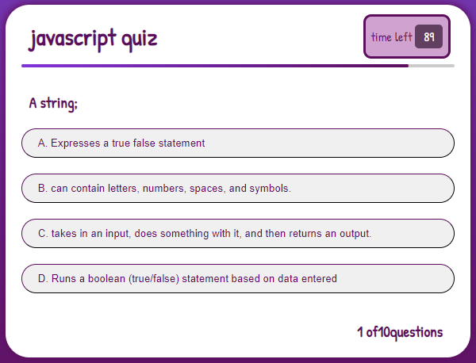
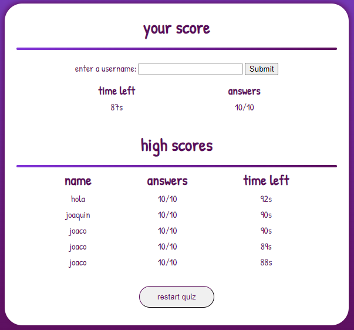
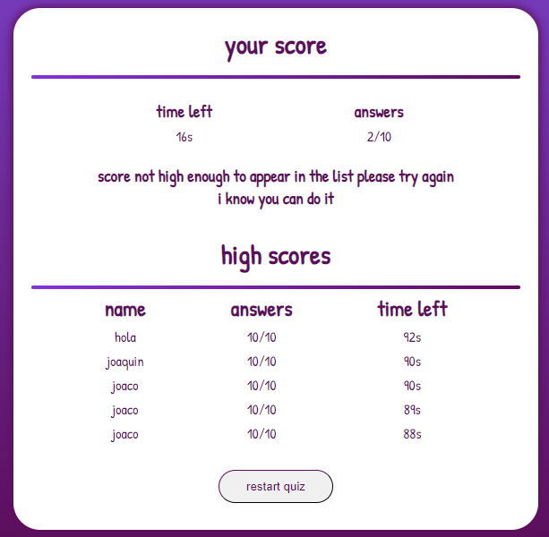

# Password-Generator

this application was made with html, css, and js. it generates a javascript quiz, that saves the highest scores 

# How to use it

to use this application the user needs to click the start button and the quiz will begin 

the user is going to have 100 seconds to finish the quiz, each wrong answer will drop the timer 10 seconds

the quiz will only end if the user finishes the question or the timer stops

when the quiz is finished this will appear

your highest scores will appear at the bottom. if your recent score is not high enough a message will appear 

telling you that the score is not high enough and to try again 

# Deployed Application

Link to the deployed project: https://joacogm12.github.io/quiz/